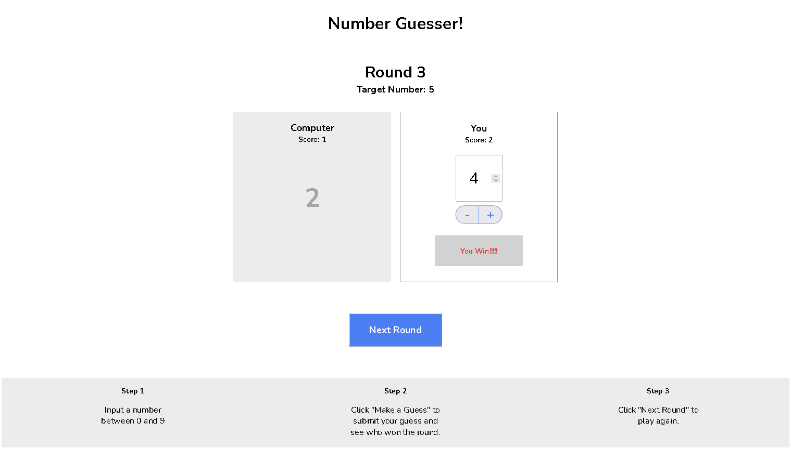

# Codecademy - Number Guesser

## Conteúdo

- [Overview](#overview)
  - [Desafio](#desafio)
  - [Screenshot](#screenshot)
  - [Links](#links)
- [Processo](#processo)
  - [Feito utilizando](#feito-utilizando)
- [Autor](#autor)

## Overview

Este é um projeto feito através da plataforma [Codecademy](https://www.codecademy.com/), no qual eu tive que criar um pequeno jogo de adivinhação, utilizando o conhecimento de javascript que adquiri até o momento no curso *Front-End Engineer - Career Path*.

### Desafio

Os usuários devem:

- Ter uma noção básica das regras do jogo;
- Definir um número de 0 a 9;
- Saber o vencedor da rodada;
- Conseguir jogar quantas vezes quiser;
- Ter acesso ao número de vitórias, seja dele ou do computador (resultado);

### Screenshot

### Links

- Solução: [GitHub Repo](https://github.com/lucasfs022/Number-Guesser)
- Live Site URL: [GitHub live site](https://lucasfs022.github.io/Number-Guesser/)

## Processo

### Feito utilizando

- HTML5; 
- CSS3;
- Javascript.

## Autor

- Website - [Lucas Silva](https://www.lfsdev.com.br)
- Linkedin - [Lucas Silva](https://www.linkedin.com/in/lucas-silva-658980161)